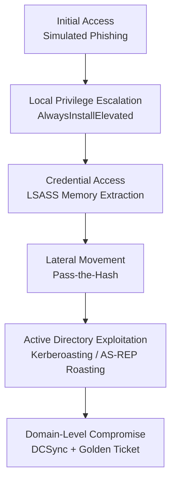

# Attack Chain Overview

This document provides a single, high-level view of the full attack chain implemented in this lab. It is intended as a quick-reference summary; detailed technical documentation for each stage is maintained separately under [`attack-chain/`](../attack-chain/).

## Stage Reference

| Stage | Document |
|---|---|
| 1. Initial Access | [`attack-chain/01-initial-access.md`](../attack-chain/01-initial-access.md) |
| 2. Local Privilege Escalation | [`attack-chain/02-privilege-escalation.md`](../attack-chain/02-privilege-escalation.md) |
| 3. Credential Access | [`attack-chain/03-credential-access.md`](../attack-chain/03-credential-access.md) |
| 4. Lateral Movement | [`attack-chain/04-lateral-movement.md`](../attack-chain/04-lateral-movement.md) |
| 5. Active Directory Exploitation | [`attack-chain/05-active-directory.md`](../attack-chain/05-active-directory.md) |
| 6. Domain-Level Compromise | [`attack-chain/06-domain-compromise.md`](../attack-chain/06-domain-compromise.md) |

Each stage document includes the objective, the specific vulnerability or misconfiguration exploited, the technique used, the result obtained, supporting evidence, and stage-specific remediation guidance.
